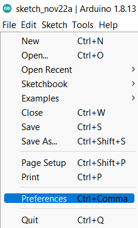
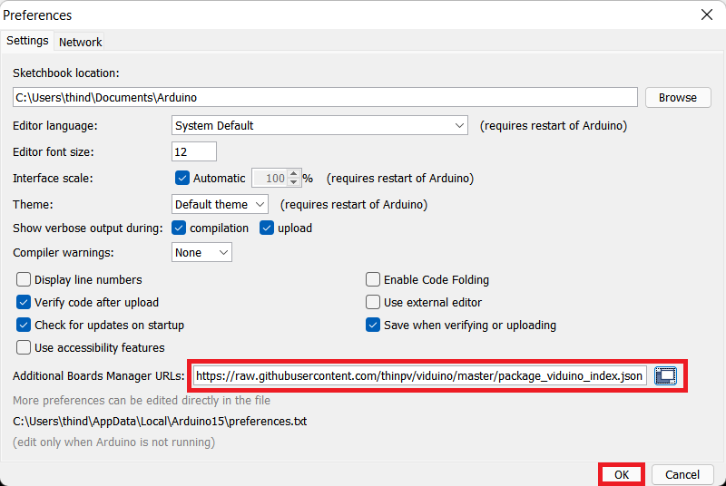
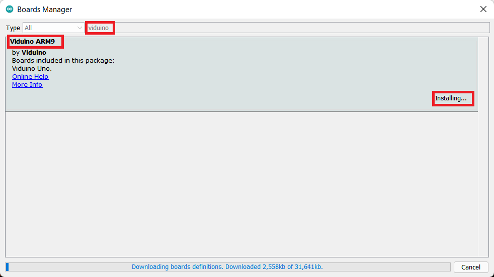
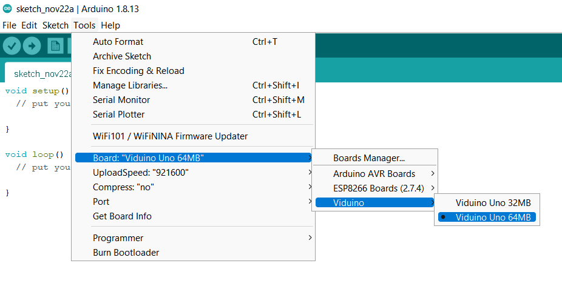

## Viduino Uno with IDE

### Installing Viduino Uno Add-on in Arduino IDE
To install the Viduino Uno board in your Arduino IDE, follow these next instructions:

1. In your Arduino IDE, go to File> Preferences



2. Enter https://raw.githubusercontent.com/thinpv/viduino/master/package_viduino_index.json into the “Additional Board Manager URLs” field as shown in the figure below. Then, click the “OK” button:
```
https://raw.githubusercontent.com/thinpv/viduino/master/package_viduino_index.json
```



3. Open the Boards Manager. Go to Tools > Board > Boards Manager…


4. Search for Viduino and press install button for the “Viduino":



5. That’s it. It should be installed after a few seconds.


